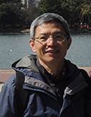
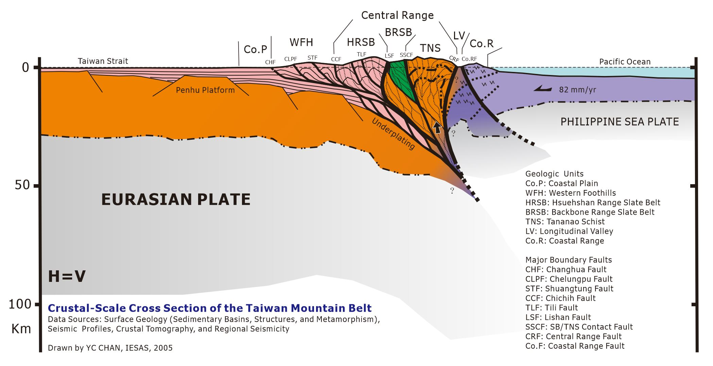

## 歡迎光臨我的網站！Welcome!  
{align=right}
I am a geologist interested in understanding the development of geological structures and surface processes that shape Earth’s evolving landscapes. My research integrates perspectives across disciplines to better constrain fundamental processes operating from the Earth’s surface to the deep crust, where many interactions remain incompletely understood or indirectly inferred from limited observations. Geologic deformation and surface evolution interact across multiple spatial and temporal scales, producing complex natural systems that can obscure underlying processes when interpreted through single-discipline frameworks. I combine physical principles with advances in geology, geomorphology, and remote sensing remote sensing -- including UAVs, airborne and satellite data, photogrammetry, LiDAR, InSAR, and thermal imaging -- to observe, quantify, and interpret Earth processes in a physically consistent framework, with emphasis on reducing uncertainty in geomorphic interpretation. Field-based investigations provide essential ground truth for hypothesis testing and model validation.   
  
  
Crustal-Scale Taiwan Mountain Belt with Geologic Units and Major Boundary Faults    
